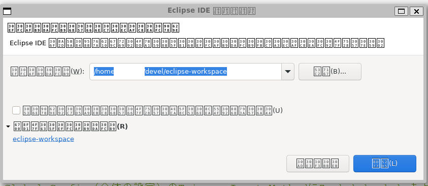
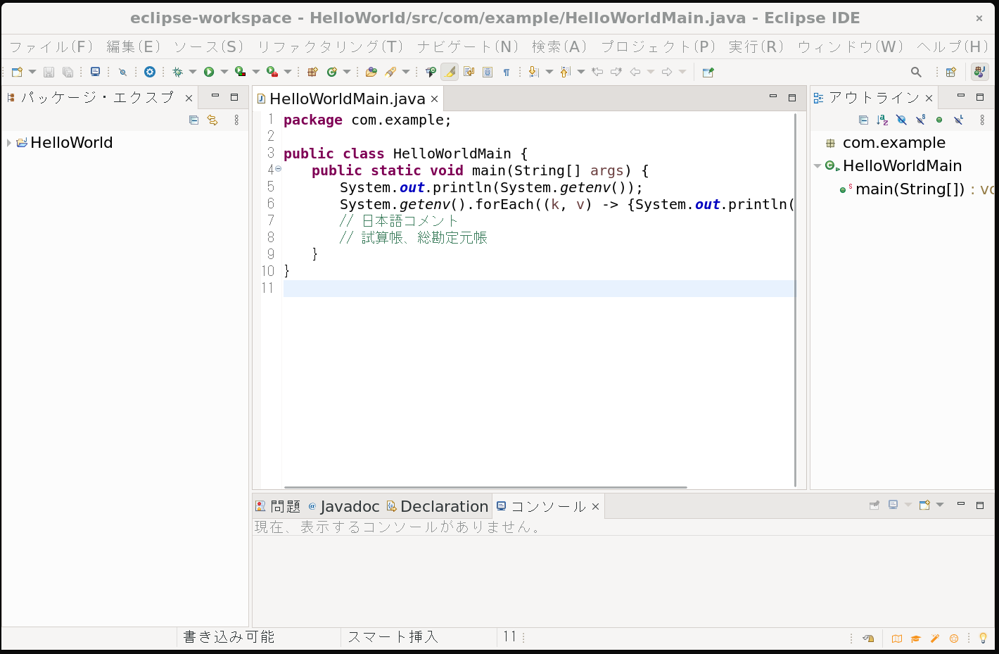
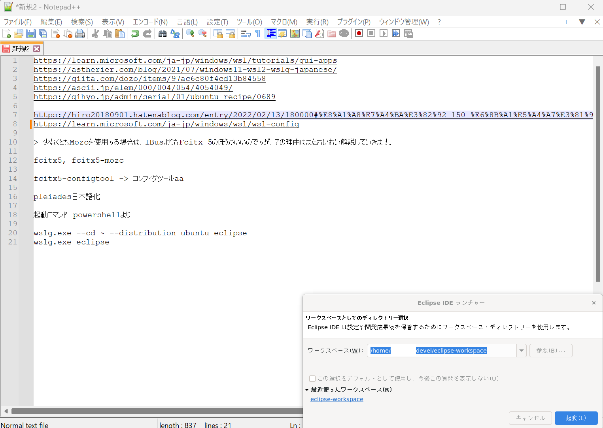
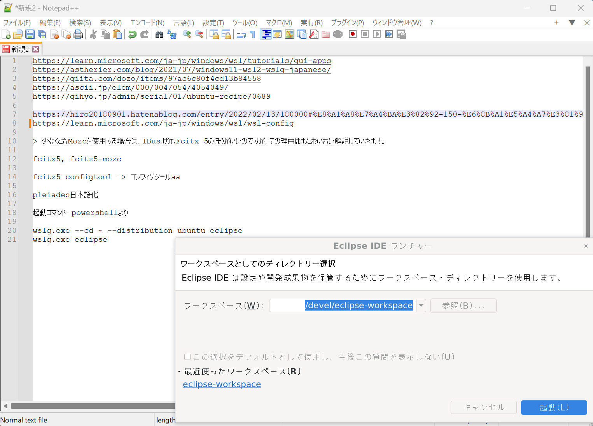
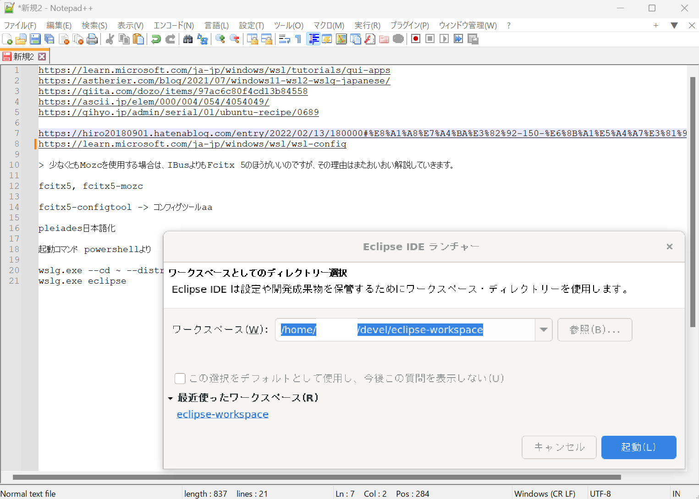

# wslg.exe 雑感

## まとめ

* eclipseおよびplaiadesをインストールしてwslg.exeで起動して簡単に動作させた
* 起動自体は簡単だが、いくつか落とし穴がある（詳細は後の方）
  * 日本語が文字化けする（当初フォント自体が認識されていない）
  * 日本語入力の特別な設定が必要（IMEが使われないため）
  * Windowsのディスプレイ設定の拡大設定が反映されない（4Kモニタなど利用している場合）

## 環境

* Windows 11 Pro 22H2
* WSL バージョン: 1.0.3.0
* カーネル バージョン: 5.15.79.1
* WSLg バージョン: 1.0.47

## ディストロ

```
~$ cat /etc/lsb-release
...
DISTRIB_DESCRIPTION="Ubuntu 22.04.1 LTS"
```

## Eclipse & Plaiadesのインストール・起動

以下のマイクロソフトの手順通り。事前準備はほとんどなく、動確の`gedit`などスムーズに起動します。

https://learn.microsoft.com/ja-jp/windows/wsl/tutorials/gui-apps

EclipseもLinux用のtar.gzをDLして適当に置いて、Plaiadesも手順通りに設定すれば問題なく適用されます。

パスを通したらwsl内で`eclipse`を実行するか、あるいはWindows上から`wslg.exe eclipse`とコマンドをたたいてもLinuxのGUIのEclipseが立ち上がります。

ただしこの時点では上に記載した通りの問題が残っています。
起動時のワークスペース選択ダイアログはこんな感じです。



## 日本語の文字化けの対応

公式ストアからインストールしたUbuntuは完全に英語環境の状態なので、日本語に対応させる必要があります。言語パックのインストールなどもそうですが、Ubuntuのデフォルト環境にはフォントが完全に不足しているので、`LANG=ja_JP.utf8`など正しく設定しても問題は解消しません。（なので正確には文字"化け"ではない気もします）

この問題の対応は簡単で、Windows/FontsフォルダのフォントをLinux環境に認識させます。

`man fonts-conf(5)`に記載の通り、`/etc/fonts/local.conf`ファイルを作成して`dir`でフォントフォルダを指定できます。

```xml
<?xml version="1.0"?>
<!DOCTYPE fontconfig SYSTEM "fonts.dtd">
<fontconfig>
    <dir>/mnt/c/Windows/Fonts</dir>
</fontconfig>
```

https://astherier.com/blog/2021/07/windows11-wsl2-wslg-japanese/

`fc-list`コマンドでWindows/fonts配下のフォントが読み込まれてたらOKです。ここまでで日本語が適用された状態でeclipseを起動できます。（wslの再起動は必要かもです）


## 日本語入力の設定

eclipseに限らずgeditなどもそうですが、wslgとして起動したアプリはキー入力もLinuxの設定に従います。なので、日本語入力システムを構築する必要があります。  
(クリップボードはホストOSと共有なので最悪コピペで日本語を貼り付けられはしますが・・・)

ArchWikiによると`fcitx`がほぼ非推奨扱いになっていたため、動確では`fcitx5`と`mozc`の組み合わせを試しました。

インストール、設定の流れはひとつ上のリンクの案内通りですが、ログイン時のfcitx5のデーモン化をうまくできなかったため、一応日本語入力は確認できたものの
スムーズな起動には課題アリといった状態でした。手触りとしてはこの日本語入力の設定が難所かなと感じました・・・/ ,' 3　 `ヽｰっ UIとしてもIMEとは異なってくるので

力尽きて試してないですが、`ibus`や5でない`fcitx`とかならもう少し楽だったかもです。

以下、fcitx5がうまく起動したときにeclipseを起動して日本語入力を確認した時のものです。



ここらへん、`Ubuntu Japanese Remix`がWSLディストロとしてStoreからインストールできれば話が早かったと思いますが、ちょっとなさそうなので現状は素のUbuntu上に設定していく必要がありそうです。

## 拡大設定

特に4Kモニタなど利用してる場合、Windowsの設定で125%だったり150%に拡大設定していることが多いと思いますが、wslgを利用した場合その設定も無視されるようです。

ちょっとスクショではわかりづらいですが、デフォルトのサイズだと次のような感じになります。この倍率だとEclipseのエディタなどはかなり小さく映る感じです。



調べたところ2つほど対策がありました。

https://hiro20180901.hatenablog.com/entry/2022/02/13/180000#%E8%A1%A8%E7%A4%BA%E3%82%92-150-%E6%8B%A1%E5%A4%A7%E3%81%99%E3%82%8B

1. gnomeのフォントサイズを拡大する

`gnome-tweaks`などの設定ツールより、GUIツールに利用されるフォントサイズを指定でき、これがWSLGアプリにも反映されます。1.5倍を指定したのが次です。



2. wslgの設定からアプリ倍率を指定する

設定は一つ上のサイトの通りです。ただし、フォント倍率での拡大に比べ相当粗いグラフィックになるため、厳しいかなというのが感想です。



## その他動確

Eclipse自体をゴリゴリ利用した動確は行ってませんが、簡単に動かしてみた限りでは特に引っかかるところはなく、思ったよりも普通に動くなといった感想でした。

プラグインのインストール


githubからのプロジェクトのコピー


実際の活用場面だとあとはビルドツールの兼ね合いや、プロキシ設定がどうか、といったところが課題でしょうか。